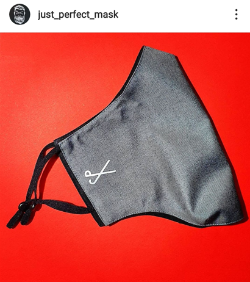
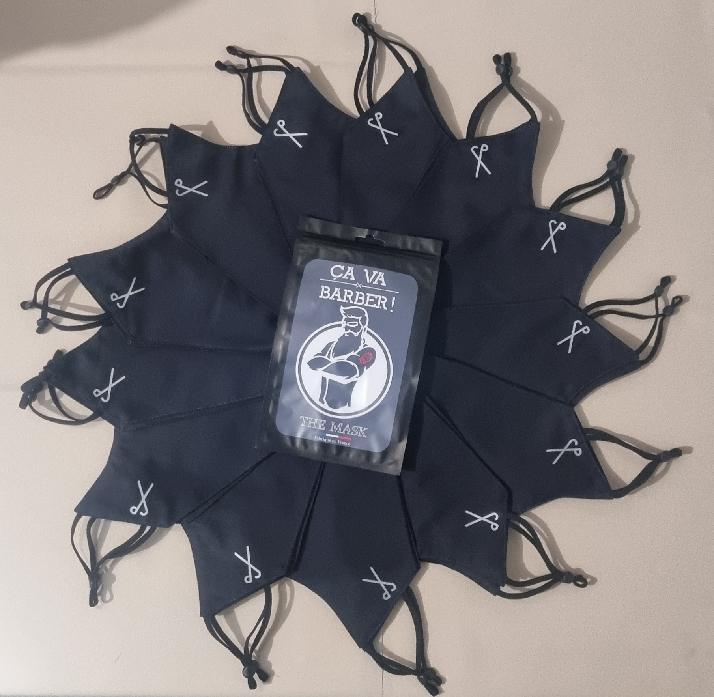
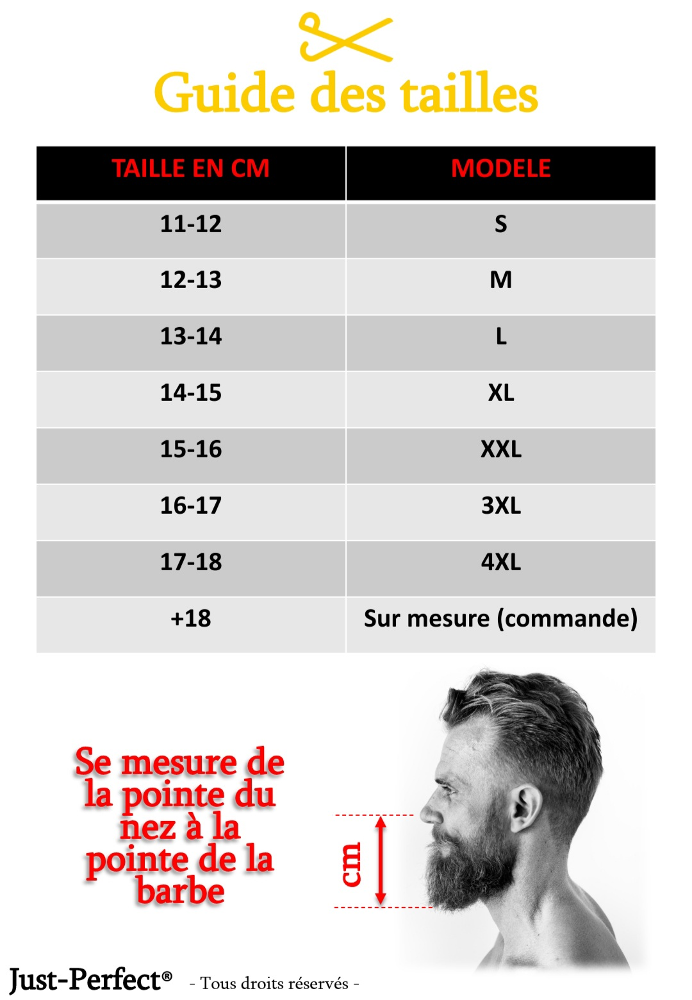
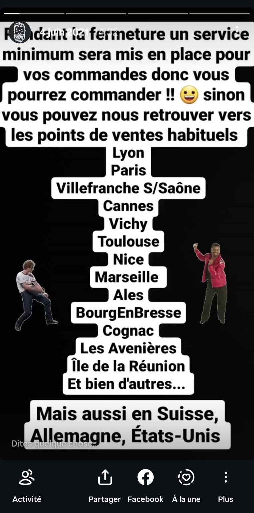
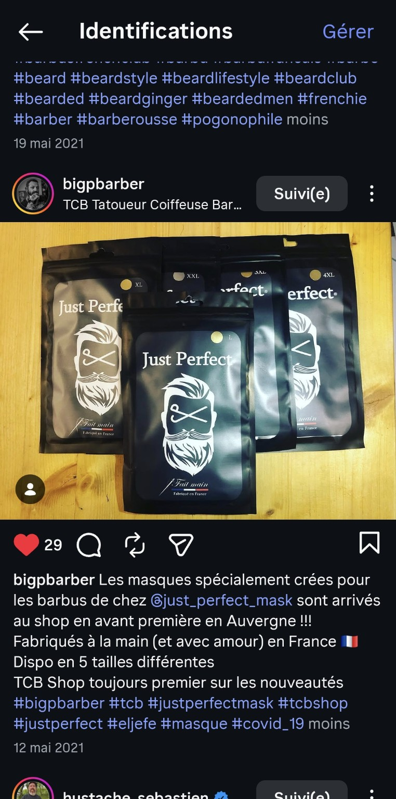
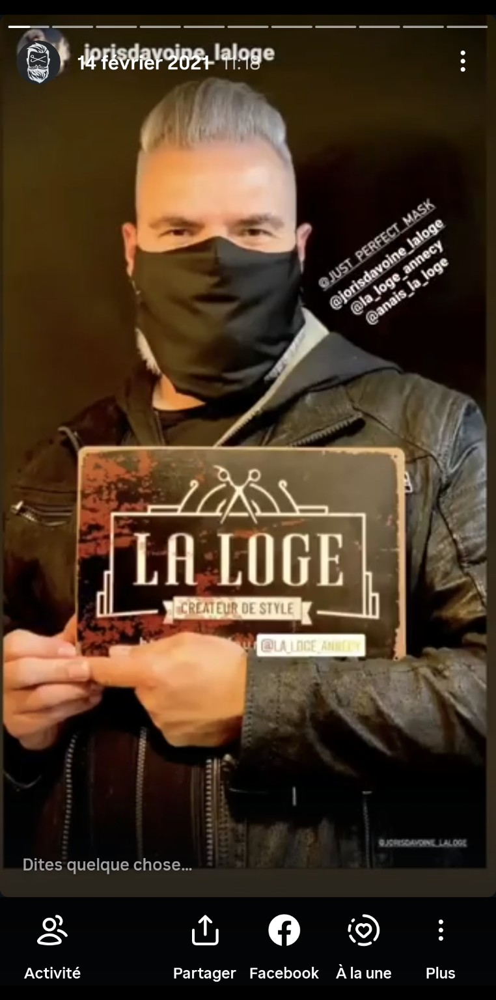
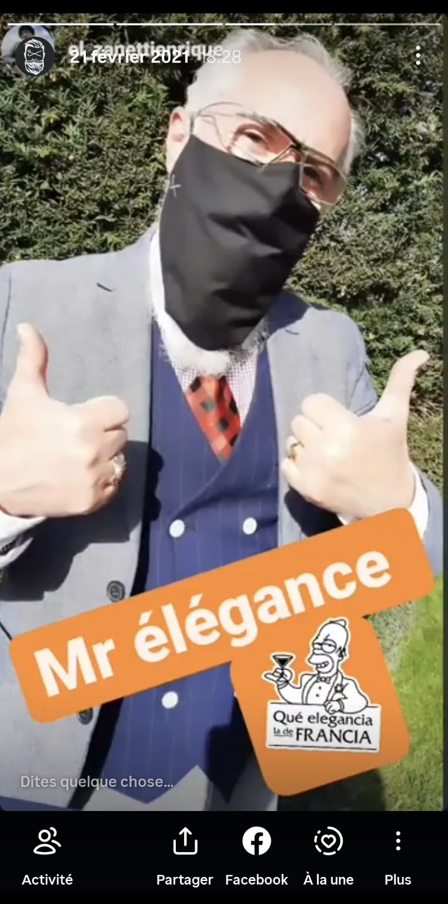
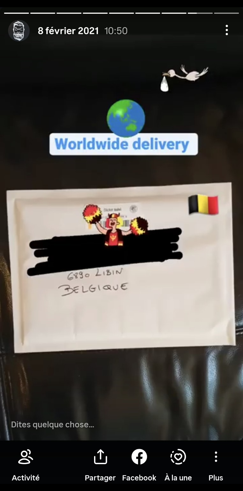
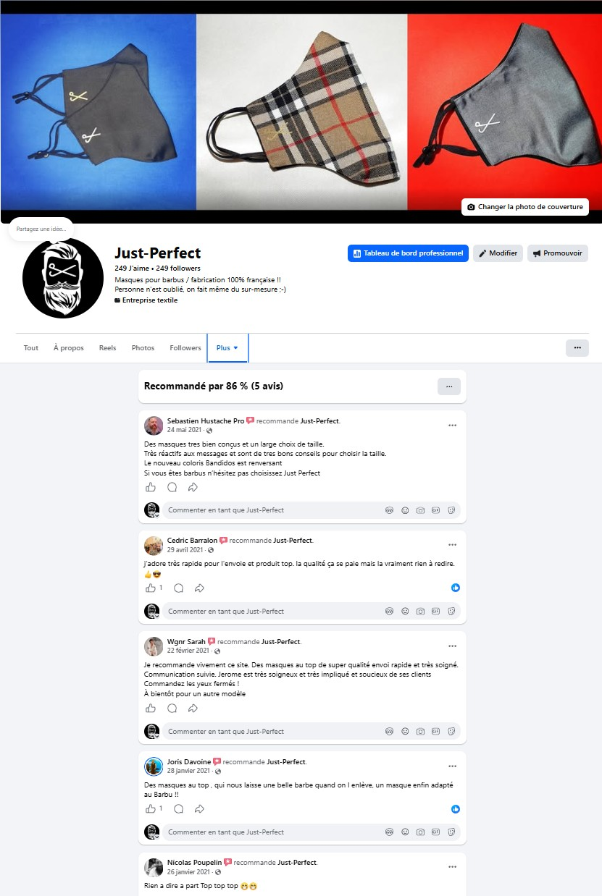
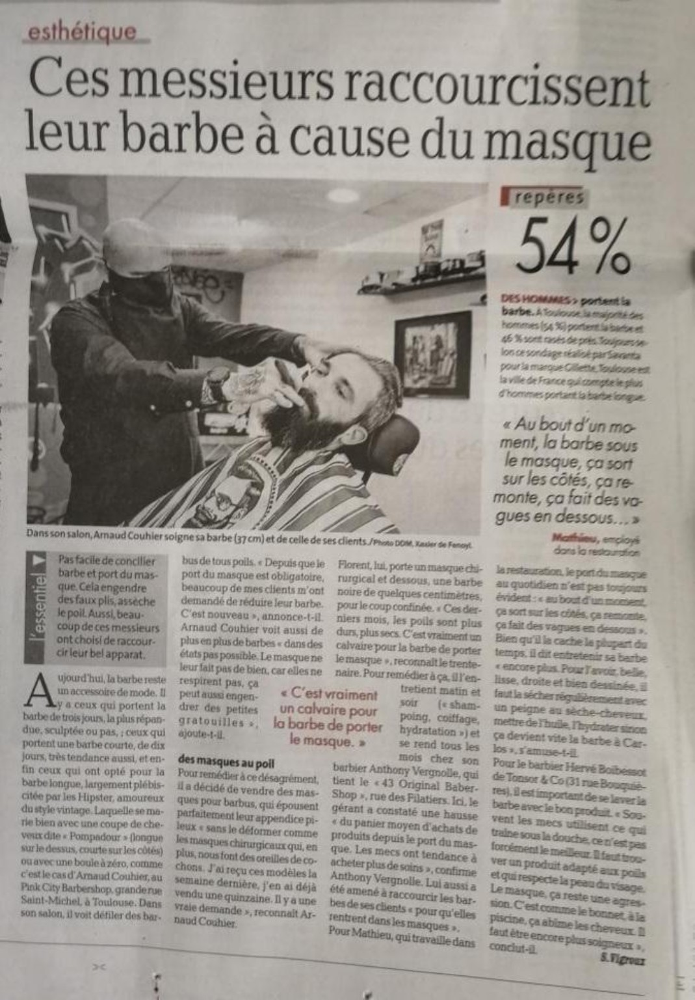

# Médias – Just Perfect Mask

Ce dossier rassemble une sélection de visuels utilisés comme preuves de l'existence, du développement et de la diffusion du projet Just Perfect Mask.

Ces éléments illustrent plusieurs dimensions du projet :

* conception produit ;
* gamme et packaging ;
* adaptation aux usages des porteurs de barbe ;
* distribution en points de vente ;
* relais par des partenaires professionnels ;
* animation d'une communauté ;
* diffusion internationale ;
* avis clients ;
* validation du besoin par des sources média.

---

## Galerie visuelle

| Miniature                                                          | Fichier                                    | Ce que le visuel démontre                                                                            |
| ------------------------------------------------------------------ | ------------------------------------------ | ---------------------------------------------------------------------------------------------------- |
|                | `01-produit-masque-hero.png`               | Image produit principale : masque textile Just Perfect Mask.                                         |
|                    | `02-gamme-packaging.jpg`                   | Gamme de produits, packaging et cohérence visuelle de la marque.                                     |
|                      | `03-guide-tailles.jpg`                     | Réflexion ergonomique : tailles, adaptation aux longueurs de barbe et usage réel.                    |
|          | `04-distribution-points-vente.jpg`         | Présence dans plusieurs villes et diffusion au-delà d'un simple canal de vente direct.               |
|             | `05-point-vente-bigpbarber.jpg`            | Référencement chez un partenaire / point de vente professionnel.                                     |
|          | `06-partenaire-la-loge-annecy.jpg`         | Relais par un acteur professionnel du secteur coiffure / barbe.                                      |
|            | `07-ambassadeur-mr-elegance.jpg`           | Visibilité auprès d'un ambassadeur ou utilisateur identifié.                                         |
|  | `08-livraison-internationale-belgique.jpg` | Preuve de diffusion internationale.                                                                  |
|                 | `09-avis-page-facebook.jpg`                | Preuve sociale : page publique, recommandations et avis clients.                                     |
|       | `10-article-presse-besoin-marche.jpg`      | Illustration du besoin marché autour des difficultés liées au port du masque pour les hommes barbus. |

---

## Lecture du portfolio

Ces médias ne sont pas présentés comme des preuves techniques ou réglementaires, mais comme des éléments visuels permettant de documenter le projet entrepreneurial.

Ils montrent que Just Perfect Mask n'était pas seulement une idée, mais un projet réellement conçu, produit, distribué, relayé par des partenaires et adopté par des utilisateurs.

Pour un jury, ces visuels permettent de vérifier rapidement plusieurs éléments :

* le produit existait réellement ;
* la marque avait une identité visuelle ;
* la gamme était structurée ;
* le projet avait des partenaires ;
* le produit était présent en points de vente ;
* la diffusion dépassait le simple cercle personnel ;
* des clients et utilisateurs ont interagi avec la marque ;
* le besoin marché était identifiable.
